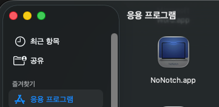
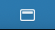

# NoNotch

A lightweight macOS utility application that **removes the notch** from your menu bar on MacBooks with notched displays.

It works by automatically adjusting the display resolution to fit the area below the notch, ensuring your menu bar contents are never hidden.

---

## ✨ Features

| Feature | Description |
|------|------|
| **Notch Bypass** | Automatically changes display resolution to fit safely below the notch area. |
| **One-Click Toggle** | Instantly enable/disable by left-clicking the menu bar icon. |
| **State Persistence** | Automatically restores your last used state upon app restart (`UserDefaults`). |
| **Launch at Login** | Native macOS login item registration via `SMAppService`. |
| **Display Detection** | Automatically reapplies settings when connecting or disconnecting external monitors. |
| **Buy Me a Coffee** | Displays a support page via in-app WebView dialog every 3 toggles. |
| **Localization** | Supports English, Korean, Japanese, and Simplified Chinese (auto-detected). |

---

## 🌐 Supported Languages

| Language | Code | Note |
|------|------|------|
| 🇺🇸 English | `en` | Default (Fallback) |
| 🇰🇷 Korean | `ko` | |
| 🇯🇵 Japanese | `ja` | |
| 🇨🇳 Chinese | `zh` | Simplified |

The app automatically detects your primary language from macOS **System Settings > General > Language & Region**.  
If your system language is not supported, it defaults to English.

---

## 🚀 Installation

```bash
# Add the custom tap repository
brew tap box-kr/homebrew-nonotch

# Install the application
brew install --cask nonotch
```

To upgrade to a newer version:
```bash
brew upgrade nonotch
```

---

## 🚀 Post-Installation Guide

1. After installation, you can find and launch the application from the macOS `Applications` folder as shown below.



2. Once launched, the app icon will appear in your top Menu Bar.



3. Double-click (or click to Enable) the menu bar icon to activate the app. This will shift the display down, allowing you to see all menu bar items that were previously hidden behind the physical notch.

---

## 📖 Usage

### Basic Controls

- **Left Click**: Toggle Notch Bar Enable/Disable
- **Right Click**: Open Menu

### Menu Structure

```
┌─────────────────────────────────┐
│ Enable / Disable Notch Bar      │  
├─────────────────────────────────┤
│ Launch at Login          ✓/✗    │  
├─────────────────────────────────┤
│ ☕ Buy Me a Coffee              │
├─────────────────────────────────┤
│ Notch detected (height: 32pt)   │  
│ Current: 3024×1964 → ...        │  
├─────────────────────────────────┤
│ Quit                       ⌘Q   │ 
└─────────────────────────────────┘
```

> 💡 Menu text automatically translates based on your macOS system language.

---

## 📝 Release Notes (v1.0.47)

- **Hide Notch (Black Menu Bar) Reliability Improvement**:
  - Fixed an issue on newer macOS versions (Monterey and later) where transparent window overlays were ignored by the menu bar's blur effect.
  - The app now perfectly hides the notch by dynamically synthesizing a black bar directly onto your desktop wallpaper. This ensures seamless and stable compatibility across multiple monitors and Mission Control spaces.

## 📝 Previous Updates (v1.0.46)

- **Dialog Window Visibility Improvements**:
  - Fixed an issue where the settings dialog persisted above all other windows, blocking content. It now acts as a standard window that can be layered naturally.
  - Adjusted the application so the dialog is no longer completely hidden when you click away. It now remains accessible via the app switcher (Cmd + Tab).
  - Improved compatibility with macOS Mission Control (Exposé) — the configuration window will now properly thumbnail and participate in your workspace overviews for easy access.
- **UI Text Updates**: Updated dialog toggle button labels for improved clarity.

---

## 🔧 Core Architecture

### Display Mode Switching Strategy (`NotchOverlayManager`)

The app searches for the optimal display mode that fits below the notch using a 4-step strategy:

1. **Exact Match** — Same width + (Current height - Notch height).
2. **Same Width Nearest** — Same width, largest mode less than or equal to target height.
3. **Same Width Upper** — Same width, greater than target height but smaller than current.
4. **Similar Width** — Width within ±100px range, highest available resolution.

---

## ⚠️ Requirements

- macOS 12.0 (Monterey) or later
- Apple Silicon (arm64) Mac
- Mac with a notched display (e.g., MacBook Pro 14"/16")
- Screen Recording / Accessibility permissions may be required for display mode changes.

---

## ☕ Support

If you find this project useful, consider buying me a coffee!

👉 [Buy Me a Coffee](https://buymeacoffee.com/funbox.kr)

---

## 📄 License

Copyright © 2026. FunBox All rights reserved.
